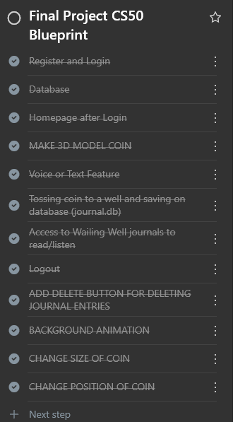

# WAILING WELL

#### Video Demo: https://youtu.be/jm0FhuLM0i4

#### Description:
Wailing Well is your trusty companion for those moments when your emotions feel as heavy as a lead balloon. This web-based journal app is designed to help you unload all those big feelings, whether you want to write them down or just record them. Think of it as a personal, non-judgmental friend who’s always there, ready to listen to your rants, rambles, or poetic outpourings—without ever interrupting. Whether you’re feeling a bit blue, seeing red, or just need to let out a good ol’ wail, Wailing Well has got your back (and your emotional baggage).

TODO

    Register and Login
    Database
    Homepage after Login
    MAKE 3D MODEL COIN
    Voice or Text Feature
    Tossing coin to a well and saving on database (journal.db)
    Access to Wailing Well journals to read/listen
    Logout
    ADD DELETE BUTTON FOR DELETING JOURNAL ENTRIES
    BACKGROUND ANIMATION
    CHANGE SIZE OF COIN
    CHANGE POSITION OF COIN
